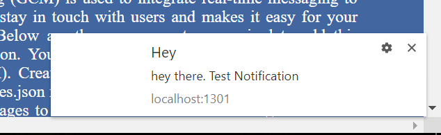

# 📌 Push Notification

This is an example of implementing Push Notifications of FCM in Angular.

At first install two packages:

* firebase
* angularfire2

`npm install firebase angularfire2 --save`

Now create a `manifest.json` file in the `src/` directory. Add the following lines to it.

``{
  "short_name": "FireStarter",
  "name": "Angular Push Notification",
  "start_url": "/?utm_source=homescreen",
  "gcm_sender_id": "103953800507"
}``

Then link it in the head of `index.html`

``<link rel="manifest" href="/manifest.json">``

 Create another file in the `src/` directory named `firebase-messaging-sw.js`. The worker just hangs out in the background with the messaging config waiting to notify a user.

 In this file just replace `'messagingSenderId': 'YOUR-SENDER-ID'`
 with the sender id generated while creating your fcm project.

 Add finally add them inside apps in `angular.cli.json`.

Copy the functions from `messaging.service.ts`. And finally use them in ngOninit in `app.component.ts`.

`this.msgService.getPermission();`
`this.msgService.receiveMessage();`
`this.message = this.msgService.currentMessage;`

Your Notification will look like:

You can use `http://pushtry.com/` to test push notifications.
